# [📈 Live Status](https://El-Paso-Community-College.github.io/upptime): <!--live status--> **🟩 All systems operational**

This repository contains the open-source uptime monitor and status page for [El Paso Community College](https://El-Paso-Community-College.github.io/upptime), powered by [Upptime](https://github.com/upptime/upptime).

With [Upptime](https://upptime.js.org), you can get your own unlimited and free uptime monitor and status page, powered entirely by a GitHub repository. We use [Issues](https://github.com/El-Paso-Community-College/upptime/issues) as incident reports, [Actions](https://github.com/El-Paso-Community-College/upptime/actions) as uptime monitors, and [Pages](https://El-Paso-Community-College.github.io/upptime) for the status page.

<!--start: status pages-->
<!-- This summary is generated by Upptime (https://github.com/upptime/upptime) -->
<!-- Do not edit this manually, your changes will be overwritten -->
<!-- prettier-ignore -->
| URL | Status | History | Response Time | Uptime |
| --- | ------ | ------- | ------------- | ------ |
|  [EPCC Public Website](https://www.epcc.edu/pages/proxy.aspx) | 🟩 Up | [epcc-public-website.yml](https://github.com/El-Paso-Community-College/upptime/commits/HEAD/history/epcc-public-website.yml) | 

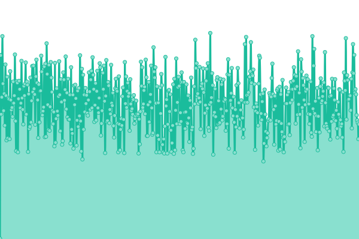 332ms
     
 | 

<a href="https://El-Paso-Community-College.github.io/upptime/history/epcc-public-website">100.00%</a>
    

|  [MyEPCC](https://my.epcc.edu) | 🟩 Up | [my-epcc.yml](https://github.com/El-Paso-Community-College/upptime/commits/HEAD/history/my-epcc.yml) | 

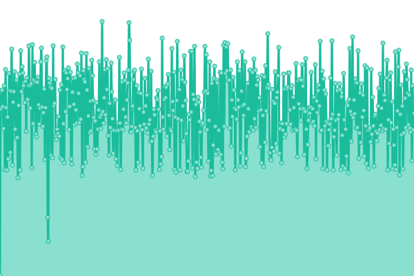 292ms
     
 | 

<a href="https://El-Paso-Community-College.github.io/upptime/history/my-epcc">100.00%</a>
    

|  [Self Service Banner](https://ssb3.epcc.edu:8444/StudentRegistrationSsb) | 🟩 Up | [self-service-banner.yml](https://github.com/El-Paso-Community-College/upptime/commits/HEAD/history/self-service-banner.yml) | 

 329ms
     
 | 

<a href="https://El-Paso-Community-College.github.io/upptime/history/self-service-banner">99.94%</a>
    

|  [Apps](https://apps.epcc.edu) | 🟩 Up | [apps.yml](https://github.com/El-Paso-Community-College/upptime/commits/HEAD/history/apps.yml) | 

 307ms
     
 | 

<a href="https://El-Paso-Community-College.github.io/upptime/history/apps">100.00%</a>
    

|  [WAT](https://wat.epcc.edu) | 🟩 Up | [wat.yml](https://github.com/El-Paso-Community-College/upptime/commits/HEAD/history/wat.yml) | 

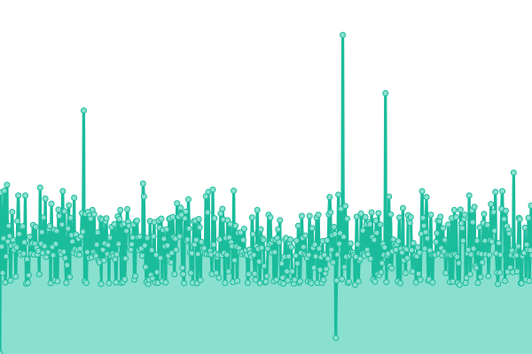 268ms
     
 | 

<a href="https://El-Paso-Community-College.github.io/upptime/history/wat">100.00%</a>
    

|  [ID Card Portal](https://idcard.epcc.edu) | 🟩 Up | [id-card-portal.yml](https://github.com/El-Paso-Community-College/upptime/commits/HEAD/history/id-card-portal.yml) | 

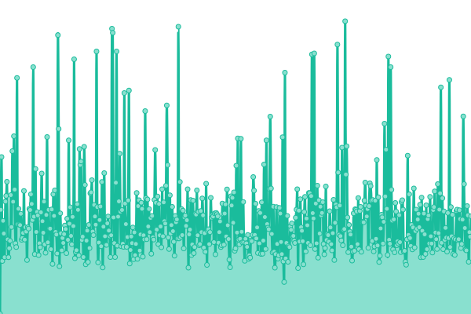 463ms
     
 | 

<a href="https://El-Paso-Community-College.github.io/upptime/history/id-card-portal">99.91%</a>
    

|  [TouchNet](https://secure.touchnet.com/C20715_tsa/web) | 🟩 Up | [touch-net.yml](https://github.com/El-Paso-Community-College/upptime/commits/HEAD/history/touch-net.yml) | 

 217ms
     
 | 

<a href="https://El-Paso-Community-College.github.io/upptime/history/touch-net">99.94%</a>
    

|  [Start](https://start.epcc.edu/paciweb) | 🟩 Up | [start.yml](https://github.com/El-Paso-Community-College/upptime/commits/HEAD/history/start.yml) | 

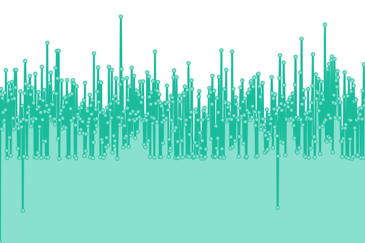 416ms
     
 | 

<a href="https://El-Paso-Community-College.github.io/upptime/history/start">100.00%</a>
    

|  [ADFS](https://fs.epcc.edu/adfs/ls) | 🟩 Up | [adfs.yml](https://github.com/El-Paso-Community-College/upptime/commits/HEAD/history/adfs.yml) | 

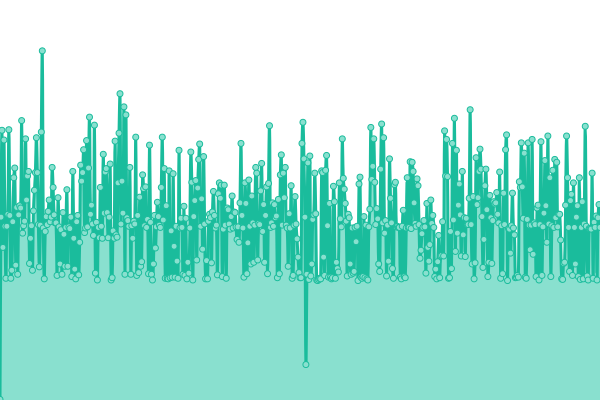 302ms
     
 | 

<a href="https://El-Paso-Community-College.github.io/upptime/history/adfs">100.00%</a>
    

|  [DNS 1](NS00.TRANSTELCO.NET) | 🟩 Up | [dns-1.yml](https://github.com/El-Paso-Community-College/upptime/commits/HEAD/history/dns-1.yml) | 

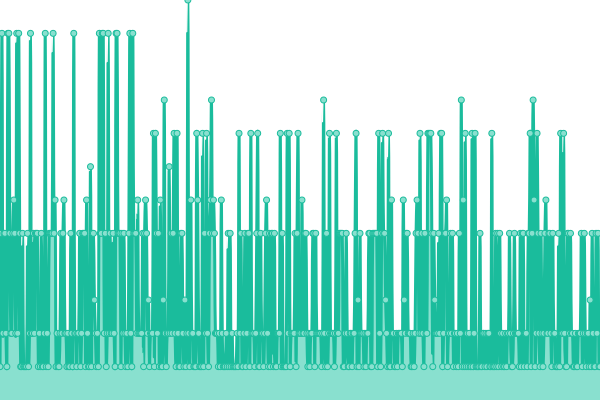 3ms
     
 | 

<a href="https://El-Paso-Community-College.github.io/upptime/history/dns-1">100.00%</a>
    

|  [DNS 2](NS01.TRANSTELCO.NET) | 🟩 Up | [dns-2.yml](https://github.com/El-Paso-Community-College/upptime/commits/HEAD/history/dns-2.yml) | 

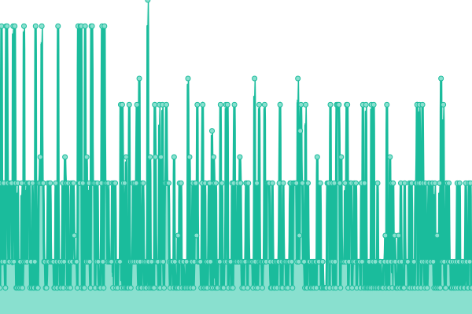 3ms
     
 | 

<a href="https://El-Paso-Community-College.github.io/upptime/history/dns-2">100.00%</a>
    

|  [DNS 3](NS02.TRANSTELCO.NET) | 🟩 Up | [dns-3.yml](https://github.com/El-Paso-Community-College/upptime/commits/HEAD/history/dns-3.yml) | 

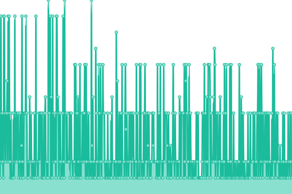 3ms
     
 | 

<a href="https://El-Paso-Community-College.github.io/upptime/history/dns-3">100.00%</a>
    

|  [DNS 4](NS03.TRANSTELCO.NET) | 🟩 Up | [dns-4.yml](https://github.com/El-Paso-Community-College/upptime/commits/HEAD/history/dns-4.yml) | 

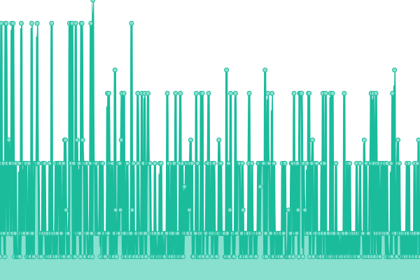 3ms
     
 | 

<a href="https://El-Paso-Community-College.github.io/upptime/history/dns-4">100.00%</a>
    

|  [DNS 5](NS04.TRANSTELCO.NET) | 🟩 Up | [dns-5.yml](https://github.com/El-Paso-Community-College/upptime/commits/HEAD/history/dns-5.yml) | 

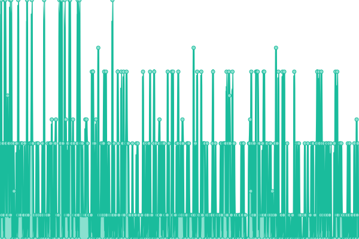 3ms
     
 | 

<a href="https://El-Paso-Community-College.github.io/upptime/history/dns-5">100.00%</a>
    

<!--end: status pages-->

[**Visit our status website →**](https://El-Paso-Community-College.github.io/upptime)

## 📄 License

- Powered by: [Upptime](https://github.com/upptime/upptime)
- Code: [MIT](./LICENSE) © [Anand Chowdhary](https://anandchowdhary.com), supported by [Pabio](https://pabio.com)
- Data in the `./history` directory: [Open Database License](https://opendatacommons.org/licenses/odbl/1-0/)
